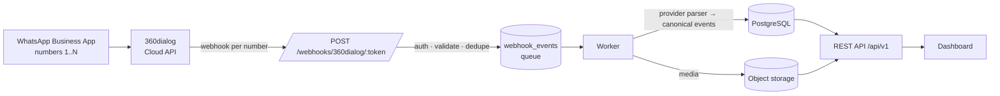

# WhatsApp Sales Dashboard

Collects sales conversations from several WhatsApp Business numbers via **360dialog**, stores them reliably in PostgreSQL, and shows them in a single dashboard.

- **Any number of WhatsApp numbers.** Each number is a row in `whatsapp_accounts`. Adding number #6 (or #20) is onboarding only, with no code or configuration changes.
- **Reps keep using the WhatsApp Business App.** With 360dialog *coexistence*, customer messages arrive as `messages` webhooks and rep replies arrive as `smb_message_echoes` (with full content).
- **Reliable ingestion.**
  - Each webhook is authenticated, saved, and answered with `200` immediately.
  - A worker processes events from a Postgres-backed queue, with retries and dead-lettering.
  - Every write is idempotent and independent of arrival order.
- **Capture health per number.** The dashboard shows, for each number, whether inbound messages *and* app-sent replies are actually arriving.



## Quick start (local)

Prerequisites: Docker (or Podman), Python 3.12 with [uv](https://docs.astral.sh/uv/), and Node 22.

```bash
cp .env.example .env                 # then fill JWT_SECRET, ENCRYPTION_KEY, WEBHOOK_SHARED_SECRET
docker compose up -d                 # PostgreSQL + SeaweedFS (S3-compatible media storage)

cd backend
uv sync
uv run python -m app.cli gen-key     # paste into ENCRYPTION_KEY in .env
uv run alembic upgrade head
uv run python -m app.cli create-user you@company.com --role admin
uv run python -m app.cli seed-demo   # optional: 5 demo numbers with realistic traffic
uv run uvicorn app.main:app --reload # API on :8000 (docs at /api/docs)
uv run python -m app.worker          # second terminal: processing worker

cd ../frontend
npm install
npm run dev                          # dashboard on http://localhost:5173
```

Run the tests with `cd backend && uv run pytest` (this needs a Postgres; see [docs/setup.md](docs/setup.md)) and `cd frontend && npm test`.

## Documentation

| Doc | What it covers |
|---|---|
| [**Setup & deployment guide**](docs/setup-and-deployment-guide.md) | **Start here.** Accounts, credentials, connecting numbers, webhooks, going live, verification |
| [docs/360dialog.md](docs/360dialog.md) | Verified 360dialog capabilities, coexistence, history limits, assumptions |
| [docs/architecture.md](docs/architecture.md) | Components, data flow, reliability design, technology choices |
| [docs/database.md](docs/database.md) | Schema, constraints, idempotency keys, retention |
| [docs/setup.md](docs/setup.md) | Local development in detail, testing webhooks locally |
| [docs/deployment.md](docs/deployment.md) | Production deployment, secrets, HTTPS, migrations, monitoring, rollback |
| [docs/troubleshooting.md](docs/troubleshooting.md) | Common failures and how to fix them |

## Repository layout

```
backend/            FastAPI app, worker, CLI, Alembic migrations, tests
  app/providers/    provider layer (360dialog lives only here)
  app/ingestion/    webhook endpoint + idempotent processor
  app/api/          REST API for the dashboard
frontend/           React + Vite dashboard
deploy/             production compose + Caddy (automatic HTTPS)
docs/               documentation
```

## Scope

This project does one thing: it collects WhatsApp sales data from multiple numbers and presents it. It does not send messages, run campaigns, or act as a CRM.
