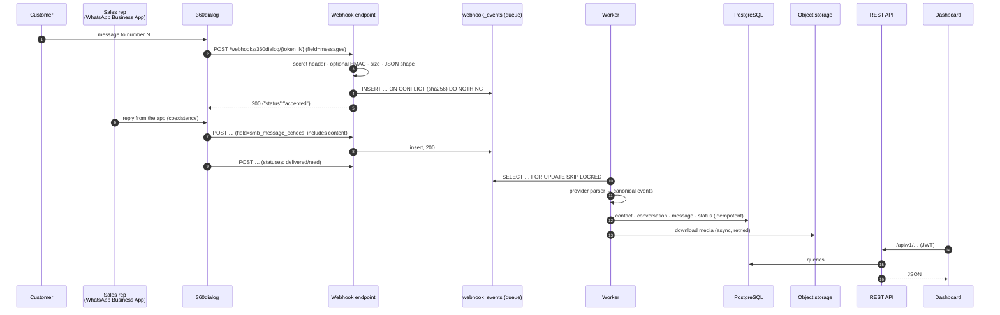

# Architecture

## End-to-end flow

## Components

| Component | Responsibility | Code |
|---|---|---|
| **Webhook endpoint** | Authenticate, validate, dedupe and save. Never parses into the domain model. | `backend/app/ingestion/webhook.py` |
| **Queue** | The `webhook_events` table: raw payload, status, attempts, `next_attempt_at`, last error. | `backend/app/models.py` |
| **Worker** | Claims events and media downloads with `FOR UPDATE SKIP LOCKED`; retries with exponential backoff; dead-letters; purges old raw payloads. | `backend/app/worker.py` |
| **Provider layer** | Turns provider payloads into canonical events; handles provider API calls (media, webhook registration). | `backend/app/providers/` |
| **Processor** | Applies canonical events to the database. It is idempotent and works regardless of arrival order. | `backend/app/ingestion/processor.py` |
| **REST API** | Auth, accounts, contacts, conversations, messages, analytics, ops. OpenAPI at `/api/docs`. | `backend/app/api/` |
| **Dashboard** | React SPA. In production it is served by the API from the same origin. | `frontend/` |
| **CLI** | Onboarding, users, history import, replay, demo data. | `backend/app/cli.py` |

## Provider isolation

The core never imports 360dialog code. The only contract is `app/providers/base.py`:

- `authenticate(headers, body)`: provider-specific signature check.
- `classify(payload)`: a cheap shape check, run inside the webhook request.
- `parse(payload) -> [ParsedChange]`: canonical `MessageEvent` / `StatusEvent` / `ContactEvent` objects.
- `fetch_media(api_key, media_id)` and `register_webhook(api_key, url, headers)`.

To add a provider, implement this protocol and register it in `providers/registry.py`. Each account row stores its `provider`.

## Reliability design

| Risk | Mitigation |
|---|---|
| Slow processing causes provider timeouts | The webhook only inserts one row and returns. All parsing and DB fan-out happen in the worker. |
| Duplicate deliveries (360dialog retries for about 24 h on non-200) | Raw dedupe on `sha256(body)`. Domain dedupe on `(account, provider_message_id)` and `(account, provider_message_id, status)`. |
| Out-of-order events | Statuses only move forward (`sent < delivered < read`). A status that arrives before its message is kept as an *orphan* and attached when the message arrives. Activity timestamps use `LEAST`/`GREATEST`. |
| Processing bug or DB hiccup | The event stays in the queue with exponential backoff (30 s → 1 h). After `EVENT_MAX_ATTEMPTS` it is marked `dead`, visible under **Ingestion**, and can be replayed. |
| Event for the wrong number (misregistered webhook) | `phone_number_id` / display number must match the account. Otherwise the event goes to `dead` without retries and is never filed under the wrong number. |
| Worker crash mid-event | The claim is the row lock inside the transaction. A crash rolls it back and the event is picked up again. |
| Media links expire | Media is downloaded right after ingestion into our own object storage. |
| Rep replies missing (echoes not arriving) | Capture health shows, per number: inbound vs echo counts, last echo time, and *unmatched statuses* (delivery receipts for messages whose content never arrived). |

## Correlating rep replies with the right conversation

1. The **number** is identified by the per-number webhook token *and* checked against `metadata.phone_number_id`.
2. The **contact** is the echo's `to`. WhatsApp ids sometimes differ from the dialled number: Brazilian mobiles may include or omit the extra `9`, and Mexican numbers the `1`. The processor matches these variants (`app/phone.py`). When an inbound webhook later supplies the authoritative `wa_id`, the contact adopts it.
3. The **conversation** is unique per `(account, contact)`, so inbound messages and echoes land in the same thread.

## Technology choices

| Choice | Why |
|---|---|
| **PostgreSQL** | Relational data with strong constraints. The constraints *are* the idempotency guarantees. Also used as the job queue (`SKIP LOCKED`), so there is no Redis or Kafka to run. |
| **FastAPI + SQLAlchemy 2 + Alembic** | Typed validation, automatic OpenAPI, mature migrations. |
| **Postgres-backed queue** | The expected load is 5 to 20 numbers. One transaction per event handles about 50 events/s per worker on a laptop, and you can run more workers to scale. |
| **S3-compatible storage** | Keeps media out of Postgres. MinIO locally; S3, R2 or GCS in production. |
| **React + Vite, hand-built SVG charts** | Small bundle (about 83 KB gzipped). The charts follow a consistent, accessible spec. |
| **One container image** | The API serves the dashboard (same origin, no CORS). The worker uses the same image with a different command. |

## Security model

- **Webhooks:**
  - per-number unguessable path token;
  - shared secret header (`X-Webhook-Secret`), registered with 360dialog and compared in constant time;
  - optional HMAC (`x-360dialog-signature`);
  - size limit and rate limit.
- **Dashboard and API:**
  - JWT bearer tokens (8 h by default), argon2 password hashes;
  - `admin` and `viewer` roles; admin-only onboarding, keys and ops;
  - login rate limit.
- **Secrets:** only from the environment. Per-number 360dialog API keys are Fernet-encrypted in the DB and never returned by the API.
- **PII:**
  - Logs never include message bodies, payloads or tokens.
  - A redaction filter masks phone-like numbers and credentials.
  - Raw payloads are purged after `RAW_EVENT_RETENTION_DAYS`.
  - Media responses carry `CSP: sandbox`.
- **HTTP:** CSP, HSTS (production), `nosniff`, `X-Frame-Options: DENY`, and CORS off unless configured.
