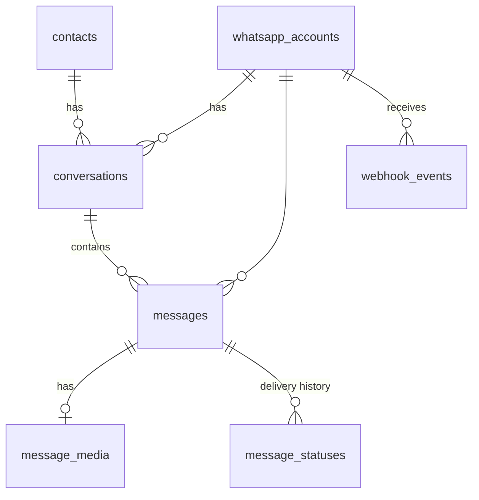

# Database

PostgreSQL 14+ (developed on 16). The schema is managed by Alembic (`backend/alembic/versions/`) and needs the `pg_trgm` extension, which the migration creates.

## Tables

| Table | Purpose | Key constraints |
|---|---|---|
| `whatsapp_accounts` | One row per connected number: provider, ids, name, status, webhook token, **encrypted** API key, capture-health timestamps (`last_event_at`, `last_inbound_at`, `last_echo_at`), `metadata` JSONB | unique `display_phone_number`, unique `webhook_token`, unique `(provider, phone_number_id)` when set |
| `contacts` | A WhatsApp user, shared across numbers: `wa_id`, profile `name`, Business-App `saved_name`, first and last activity | unique `wa_id`; trigram index for search |
| `conversations` | The thread between one number and one contact: counters and first/last (inbound/outbound) timestamps, `assigned_agent` (reserved) | unique `(account_id, contact_id)` |
| `messages` | Canonical message: direction, source (`webhook` / `echo` / `history`), type, text, type-specific `content` JSONB, reply context, current status and error | unique `(account_id, provider_message_id)`; trigram index on `text` |
| `message_statuses` | Append-only status history. `message_id` is NULL until the message is known (orphan) | unique `(account_id, provider_message_id, status)` |
| `message_media` | Media metadata, object-storage key, download state and retries | unique `message_id` |
| `webhook_events` | Raw provider payload and the processing queue (`pending` → `processed` / `ignored` / `retry` → `dead`) | unique `(provider, payload_sha256)` |
| `users` | Dashboard users (`admin` / `viewer`) | unique `lower(email)` |

## Definitions used by the dashboard

- **Conversation:** all messages between one WhatsApp number and one contact. WhatsApp itself has no thread object.
- **Active conversation:** the last message (either direction) is within `ACTIVE_CONVERSATION_HOURS` (default 24 h, the same as WhatsApp's customer-service window). This is computed at query time, never stored, so it cannot go stale.
- **Inbound / outbound:** from the customer / from the business. Outbound content comes from coexistence echoes or history.
- **Unmatched (orphan) status:** a delivery receipt for an outbound message whose content we never received.

## Operational notes

- **Connection pooling:** SQLAlchemy pool per process (`DB_POOL_SIZE`, `DB_MAX_OVERFLOW`, `pool_pre_ping`). If you use PgBouncer, use session or transaction mode. The worker uses one short transaction per event.
- **Transactions:** each queue item is processed in its own transaction plus savepoint. Any failure rolls back everything that event wrote.
- **Retention:** `processed` / `ignored` raw events older than `RAW_EVENT_RETENTION_DAYS` (default 30) are deleted by the worker. `dead` events are kept until handled. Canonical data is never deleted automatically.
- **Backups:** use your managed Postgres's automated backups with point-in-time recovery. Back up the media bucket (versioning) as well.
- **New migration:** edit `app/models.py`, run `uv run alembic revision --autogenerate -m "…"`, review the file, then run `uv run alembic upgrade head`. CI fails if models and migrations drift (`alembic check` locally).
